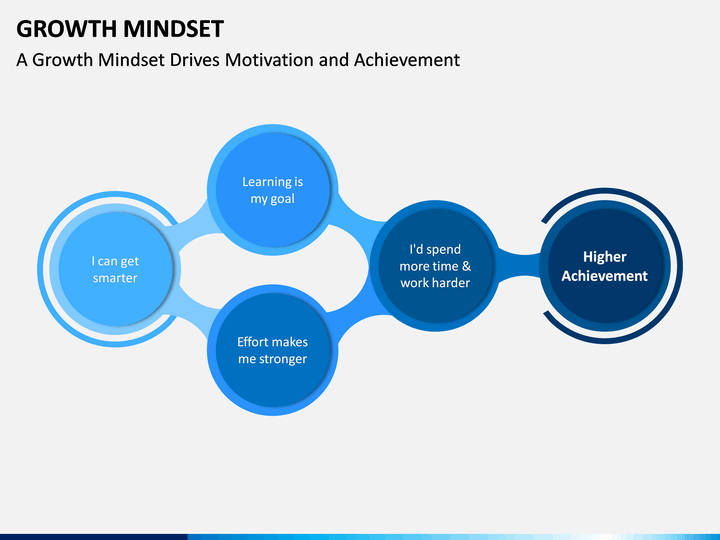

# what is growth mindset
### A growth mindset describes people who believe that their success depends on time and effort. People with a growth mindset feel their skills and intelligence can be improved with effort and persistence. They embrace challenges, persist through obstacles, learn from criticism and seek out inspiration in others’ success.

---

---
## The power of believing that you can improve

#### Carol Dweck in her video talked about the schools that put the degree “not yet” instead of “failed”and how it makes people happy not that sad when they are failed, and also talked about givving challenges to kids and how they deal with the problem some of them thinking of it and some are get bored and some gone to cheating, in order it is not sutable to make a reward every time to the kids, they used a network game as a reward. she said about how the “not yet” gives kids a big confidence and a path to the future to think and get smarter, and thoese kids who does not use this stratigy they still have a lower and lower grades, then she talked about childrens in different places have differnt levels at the end she recommended that we should care about childs and consider about there mental skills and improve them.

## The power of passion and perseverance

#### Angela Lee Duckworth: tells a story of leaving her first work and starting teaching mathmatics at schools and she noticed that thier intelligence are not very good, after years in teaching she conclude that teachers should learning from a motivational and psychological perspective  then she moved and bacame a psychologist and works with psychological perspective with teachers and students and use serveys that students and thier parteners fill and make help with them to improve and build childrens. finally she talked about how to grit in kids and the best way is what called called growth mindset which is a think of the ability of learn is not fixed and it can be changed.
---
# keep yourself in a growth mindset by these steps:
* dedication of time
* effort and energy
* Working on one’s flaws

