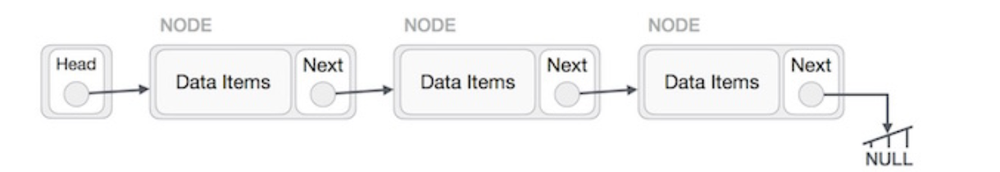

# Linked List
## Linked List - A data structure that contains nodes that links/points to the next node in the list.

---
## types of linked list

1. Singly - there is only one reference, and the reference points to the Next node in a linked list.
2. Doubly - there is a reference to both the Next and Previous node.
3. A circular linked list it doesn’t end with a node pointing to a null value. Instead, it has a node that acts as the tail of the list (rather than the conventional head node), and the node after the tail node is the beginning of the list.

##### The best way to approach a traversal is through the use of a while() loop. This allows us to continually check that the Next node in the list is not null the Current variable will tell us where exactly in the linked list we are

##### every node have two parts data and the reference to the next node .

## What Is Big O ?
### Big O Notation is a way of evaluating the performance of an algorithm.and we can say it is a way to express the amount of time that a function, action, or algorithm takes to run based on how many elements we pass to that function.

``There are two major points to consider when thinking about how an algorithm performs: how much time it requires at runtime given how much time and memory it needs.``

* An O(1) function takes constant time, which is to say that it doesn’t matter how many elements we have, or how huge our input is: it’ll always take the same amount of time and memory to run our algorithm.
* An O(n) function is linear, which means that as our input grows (from ten numbers, to ten thousand, to ten million)
* O(n²) function, which clearly takes exponentially more time and memory the more elements that you have

``why a linked list doesn’t need a contiguous block of memory. Because a single node has the “address” or a reference to the next node, they don’t need to live right next to one another``

##### by rearranging some pointers we can grow and shrink dynamically during a program’s execution in the linked list

## implement linked list
1. we find the head node of the linked list.
2. we’ll make our new node, and set its pointer to the current first node of the list.
3. we rearrange our head node’s pointer to point at our new node.

#### The Big O of time for Includes would be O(n). The Big O of space for Includes would be O(1) The Big O of adding node at the bigging would be O(1) The Big O of adding node before would be O(n)

***a linked list is usually efficient when it comes to adding and removing most elements, but can be very slow to search and find a single element***

